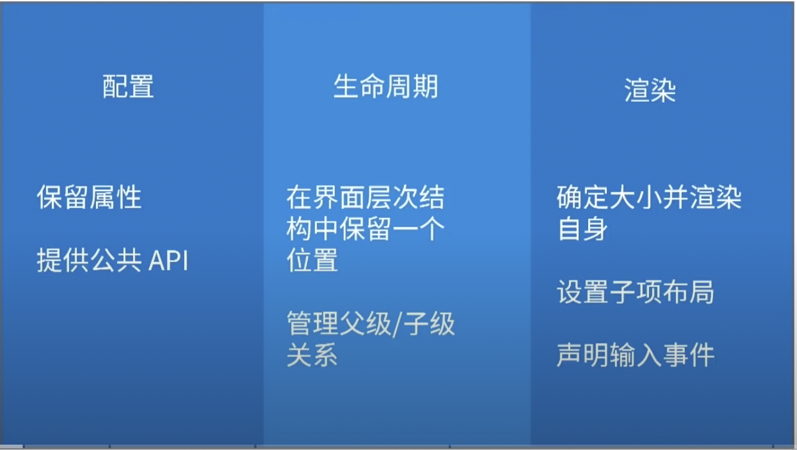

Widget / Element / Render Object

Widget: 描述一个元素(element)的配置 (describes the configuration for an Element)

Element: 树中特定位置的 Widget 实例化, 您可以将其视为管理小部件的生命周期

RenderObject: 处理尺寸、布局和绘画（handles size, layout, and painting）

